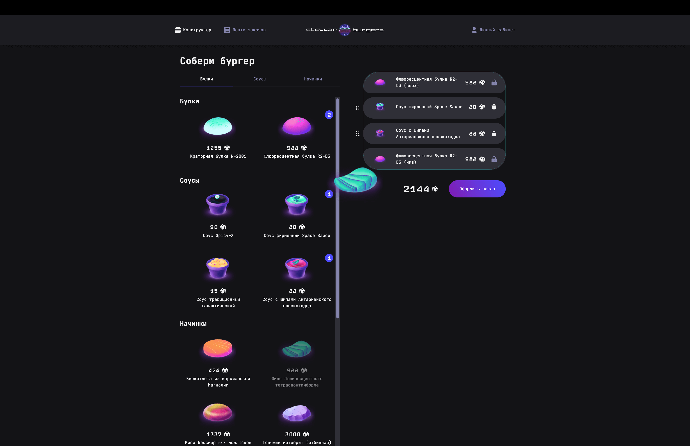
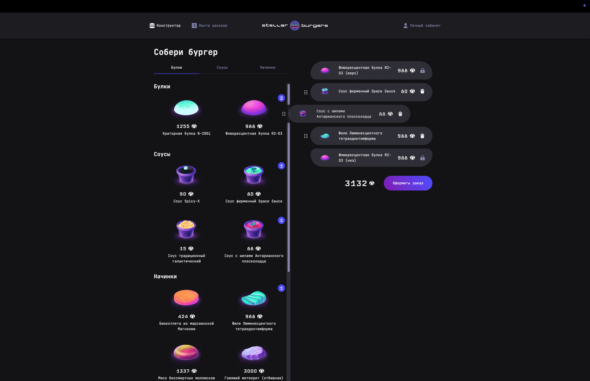
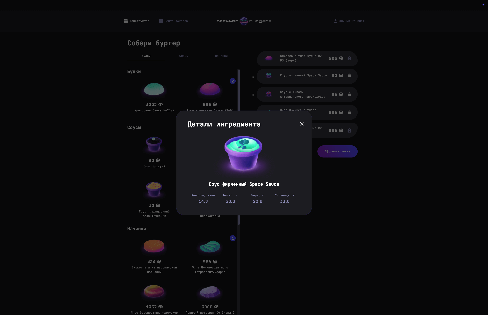
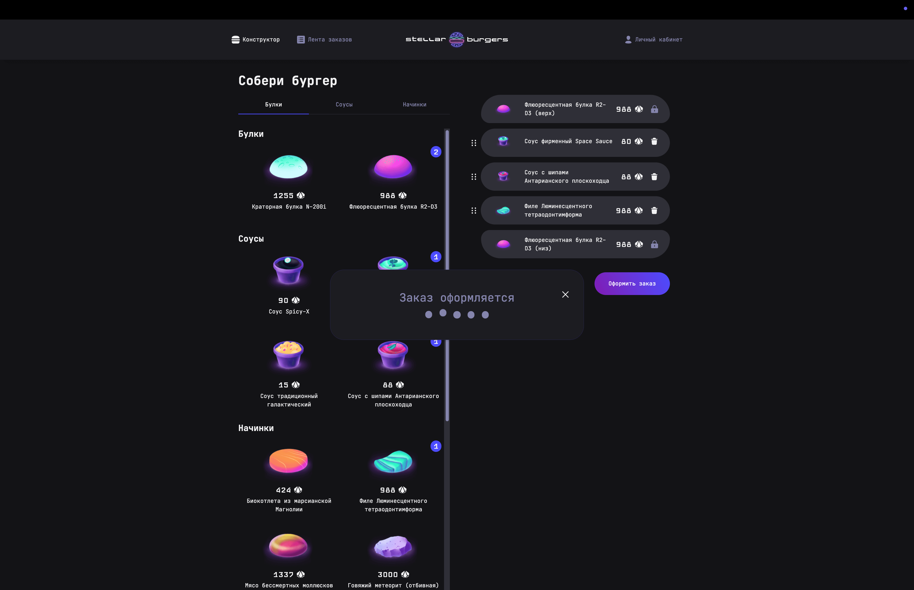
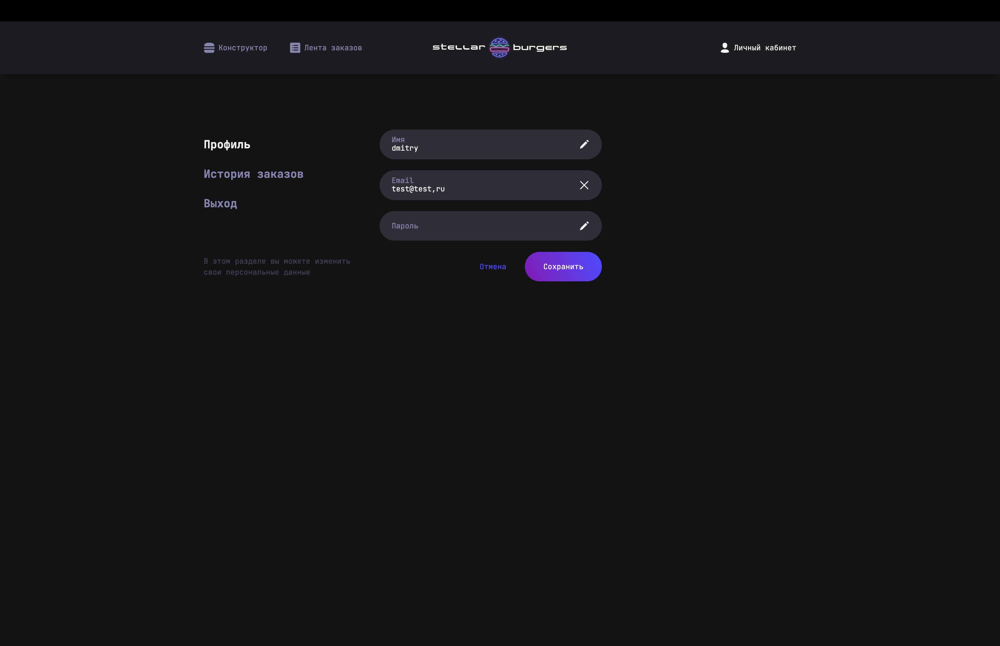
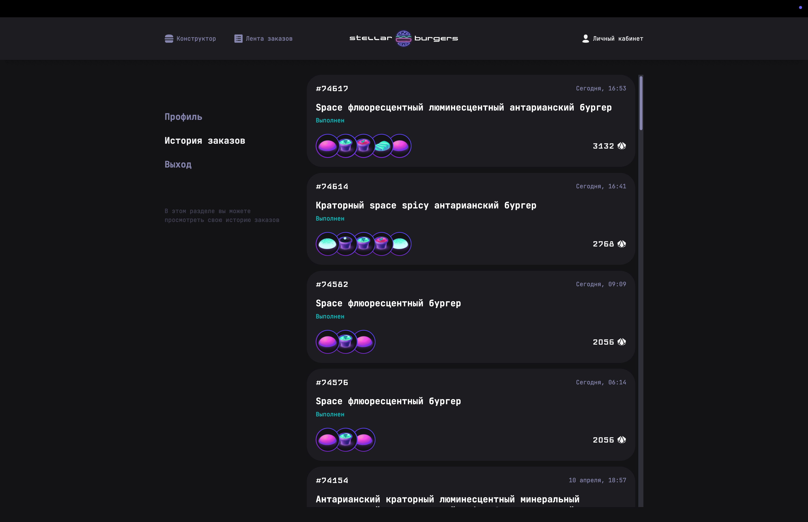
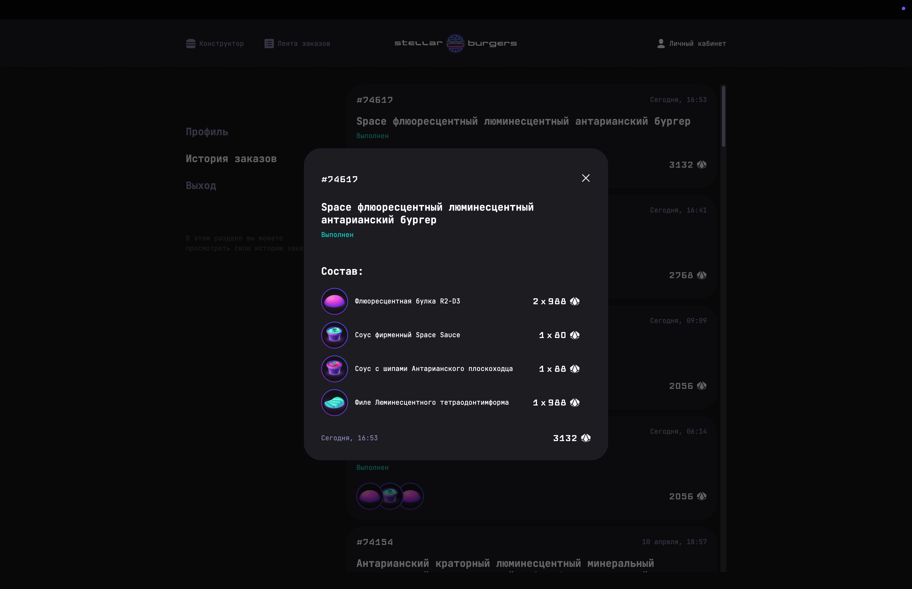
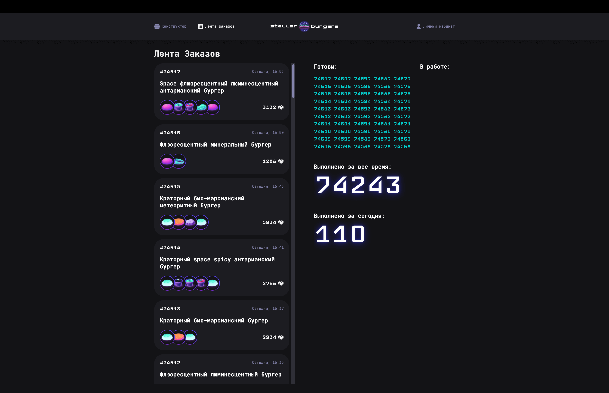
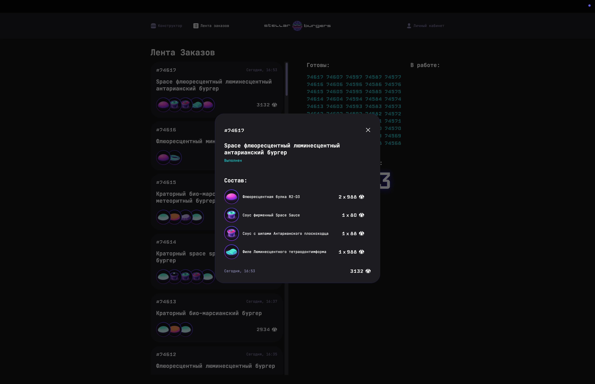

# 🚀 React Stellar Burger

[](https://reactjs.org/)
[](https://www.typescriptlang.org/)
[](https://vitejs.dev/)
[](https://redux.js.org/)
[](./LICENSE)

> Interactive space-themed burger constructor built with React + TypeScript.
> Educational project developed as part of the **Yandex Practicum** program.
> Uses the **Feature-Sliced Design (FSD)** architecture.

<details>
  <summary>Click to expand</summary>
  <div align="center">
     
     
     
     
     
     
     
     
     

  </div>
</details>

---

## 🌐 Live Demo

🔗 **Deployed on GitHub Pages:**
[react-stellar-burger](https://tokmakda.github.io/react-stellar-burger/)

📦 **Deployment branch:**
[`gh-pages`](https://github.com/TokmakDA/react-stellar-burger/tree/gh-pages)

---

## 📌 Features

- Interactive burger constructor with drag & drop
- Modal ingredient details
- Order creation and status flow
- Full routing with React Router v7
- Token-based authentication flow
- Redux + RTK Query for API integration
- Code architecture based on FSD principles
- Refresh token flow
- Forgot password flow
- Background location routing

---

## 🧪 Tech Stack

- ⚛️ React
- ⛑️ TypeScript
- 🌐 React Router v7
- 🎯 Redux / Redux Toolkit / RTK Query
- 🧲 React DnD
- 🚀 Vite
- 💅 SCSS
- 🍔 React Developer Burger UI Components

---

## 🚀 Scripts

| Command         | Description                                  |
| --------------- | -------------------------------------------- |
| `dev` / `start` | Launches dev server and opens the app        |
| `build`         | Builds the production-ready app              |
| `preview`       | Serves local preview of the production build |
| `test`          | Runs unit tests                              |
| `test:ui`       | Runs UI tests                                |
| `cypress`       | Launches Cypress E2E tests                   |
| `format`        | Formats the codebase                         |
| `lint`          | Lints the code                               |
| `lint:fix`      | Fixes linting errors                         |

---

## 🛠️ Installation

```bash
git clone git@github.com:TokmakDA/react-stellar-burger.git
cd react-stellar-burger
npm install
npm run dev
```
